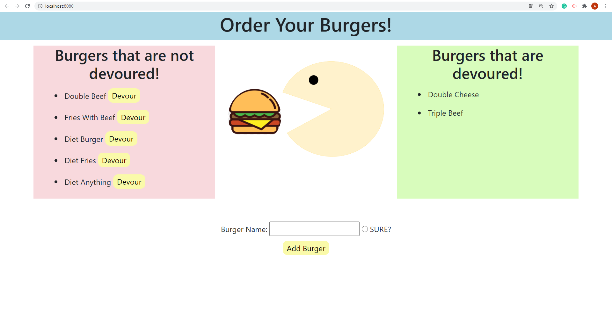

# Node-Express-Handlebars

Link to GitHub: https://github.com/DEG18/Node-Express-Handlebars

Link to Heroku: https://nodeexpress-handlebars.herokuapp.com/

## About

This program uses node, express-handlebars, MySQL. Users can add the name of the food they want to add, and click the devour button to transfer the name of the food to the devoured area.

## ScreenShot

